# Cyber Valley Tickets

## Remote Ops (cyberia.my)

Deployment on `cyberia.my` uses a bare Git repo + worktree:
- bare repo: `/home/tickets/repo.git`
- worktree (main): `/home/tickets/tickets`

Local git remote:
- `cyberia` -> `ssh://tickets@cyberia.my:/home/tickets/repo.git`

### Update Workflow

1. Push changes from your machine:
```bash
git push cyberia main
```

2. SSH to the server and apply changes from the worktree:
```bash
ssh tickets@cyberia.my
cd /home/tickets/tickets
```

3. Common actions (run on the server):
```bash
# Full restart (recreates sqlite DB, redeploys contracts, rebuilds frontend)
make prod-restart

# Rebuild only the production frontend (updates /home/tickets/tickets/client/dist)
make prod-rebuild-frontend

# Restart only Django runserver inside the existing tmux session
make prod-restart-backend

# Restart only indexer inside the existing tmux session
make prod-restart-indexer
```

Notes:
- `make prod-restart` runs `./launch.sh --production-frontend` which will reset
  sqlite (`backend/db.sqlite3`) and re-seed events/tickets.
- Frontend env vars are baked at build time. If you change `.env` values like
  `PUBLIC_GOOGLE_MAPS_API_KEY`, run `make prod-rebuild-frontend`.

## Problem

Cyber Valley wants to host events and needs a convenient way to accept events offers from creators, sell tickets in crypto, verify bought tickets from customer's devices and distribution of acquired means across creator, master and dev team

## Solution

Create Web3 mobile first web app based on Ethereum network which covers main needs

### Domain

#### Roles

##### Customer

Public role which has the following authorities:

- List events
- Buy ticket to event

##### Staff

Assigned by the master role. Has all customer's authorities and:

- Verify tickets for any event

##### Creator

A.k.a shaman has all customer's authorities and:

- Send event request
- Edit own event requests
- See pending own event requests

##### Master

Has all customer's, staff's and creator's authorities and:

- Create event place
- Approve event requests
- Edit event requests
- Cancel event
- Close events

#### Event data

Abstraction over some entertainment in the specific place during some amount of days.

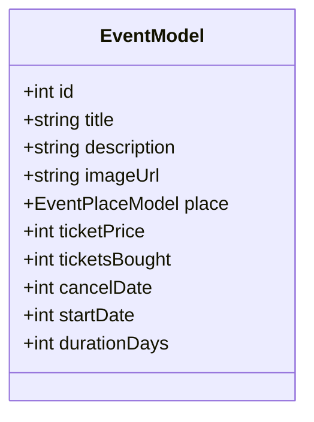

### Use cases

#### Create event place

**Accessible only by master**

Adds a new event place

**Emits** `EventPlaceUpdated`

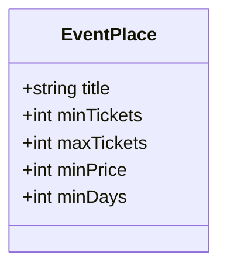

#### Update event place

**Accessible only by master**

Updates existing event place by it's id

> **Warning:** Event place can't be changed if there is another event

**Emits** `EventPlaceUpdated`

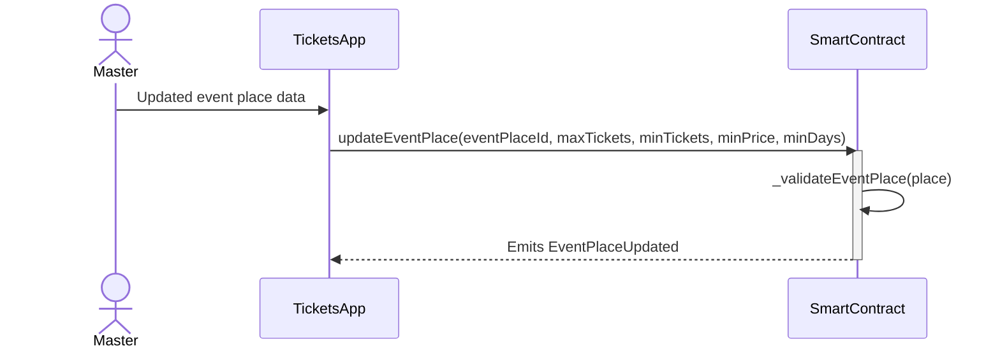

#### Save socials

Supported socials:

- Telegram
- Discord
- Whats App
- Instagram

##### V1

Used socials stored in the browser cache, so customer should input his social on each new device

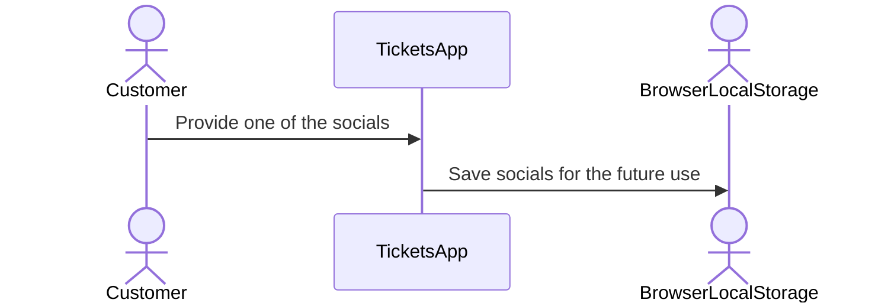

##### V2

Used socials stored in the centralized database which allows to sync state of the all devices

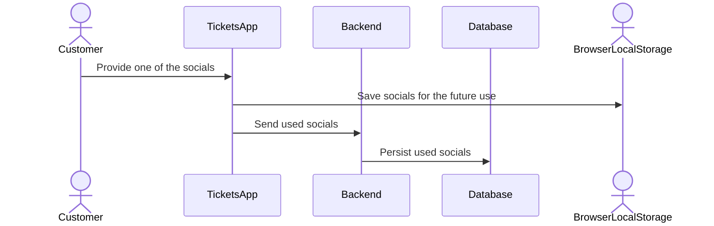

#### Submit event request

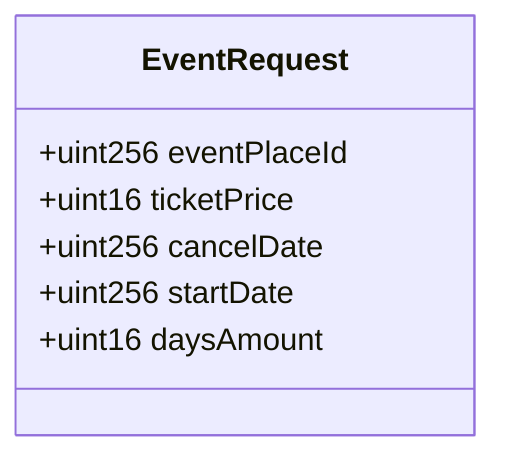

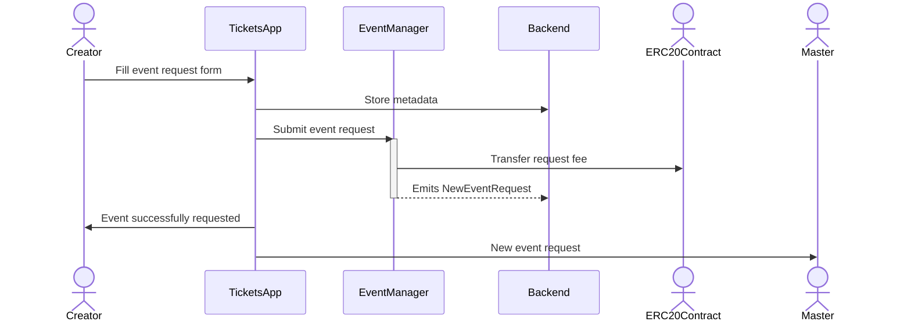

#### Approve event request

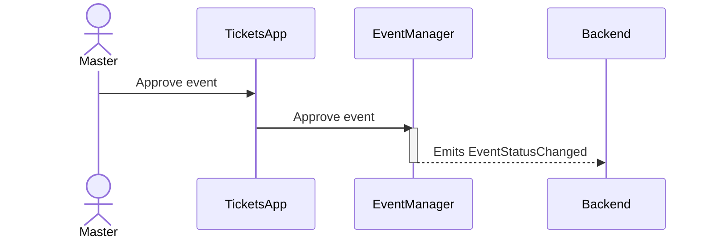

#### Decline event request

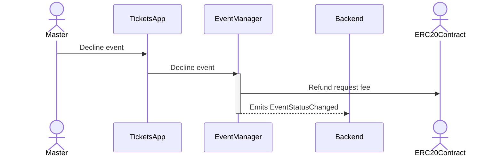
#### Edit event

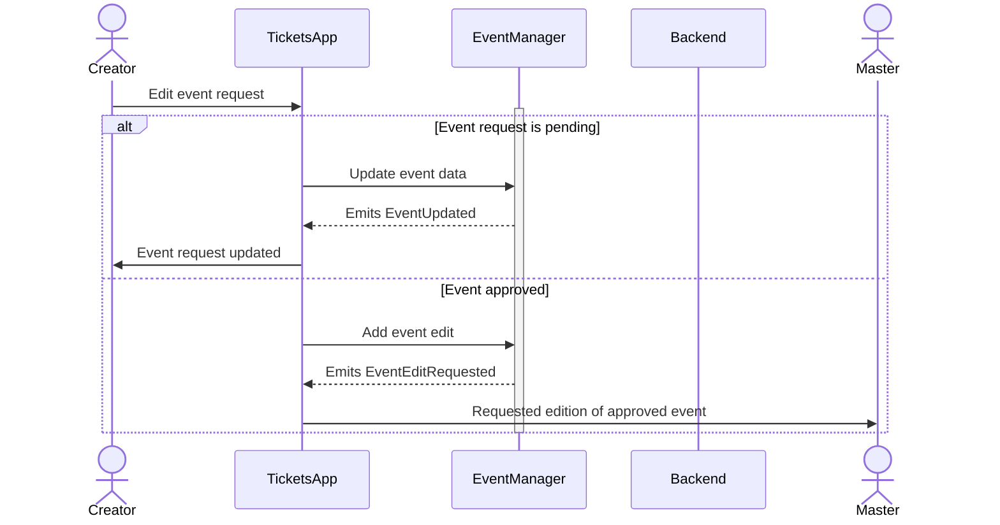
#### List events

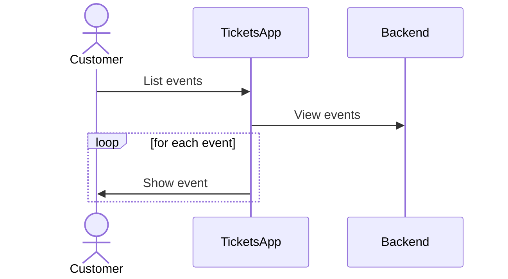
#### Buy ticket

##### V1

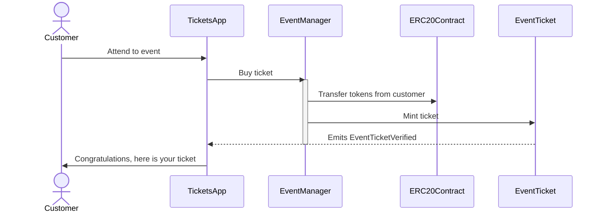
#### Add / remove staff

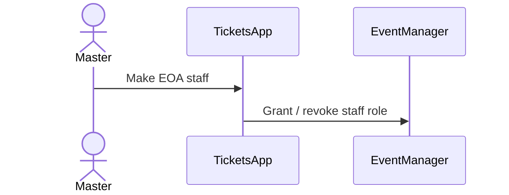
#### Show ticket

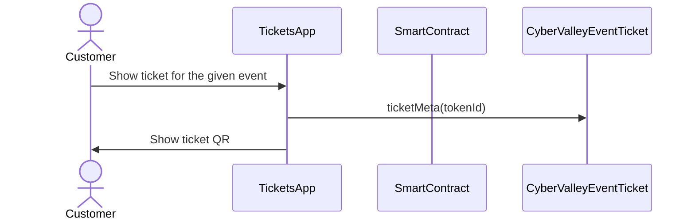
#### Verify bought ticket

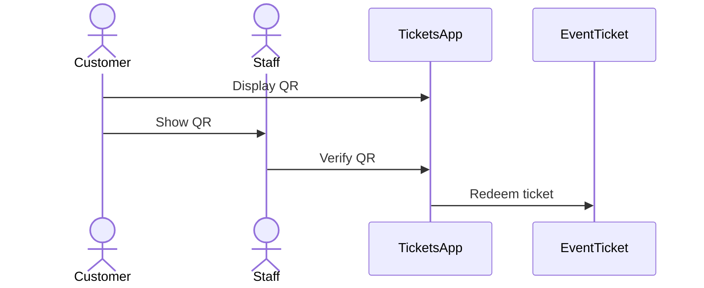
#### Close event

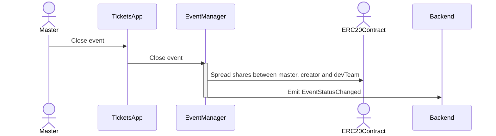
### Tech stack

Solidity, OpenZeppelin, React, TypeScript, Tailwind, ethers.js, IPFS

Also a thin backend over database is required to provide free of charge ability to change event request data before it's approve, so it'll be implemented with Python, PostgreSQL and Django.

### Excluded features from the first stage

Given list of features can be interpreted as obviously required or any section below can unintentionally imply them, so they explicitly mentioned

- Tickets refund
- Cancel or refund event request submission
- Any sort of push notifications about any updates or new data
- Ticket price change on sold out and increasing available seats
- Remove assigned staff person to the event

### Proxy contract vs multiple versions

Because of big amount of reads from the blockchain (which lead to spending gas on call delegation in proxy) we offer to use multiple versions and support them on the client side. To prevent difficulties of funds & data migration between versions, we'll create new events in a new version, but still support the previous ones until all events there will be closed or canceled.

### Component design

#### General overview

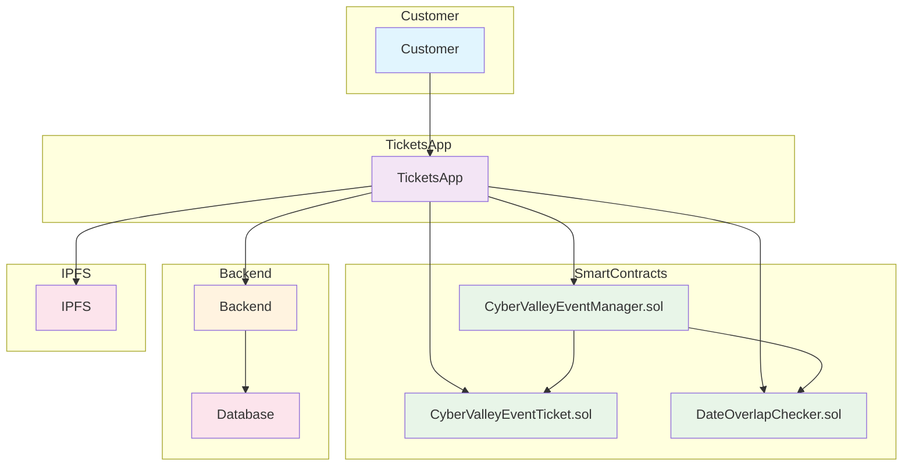
#### Smart contract

##### Event manager

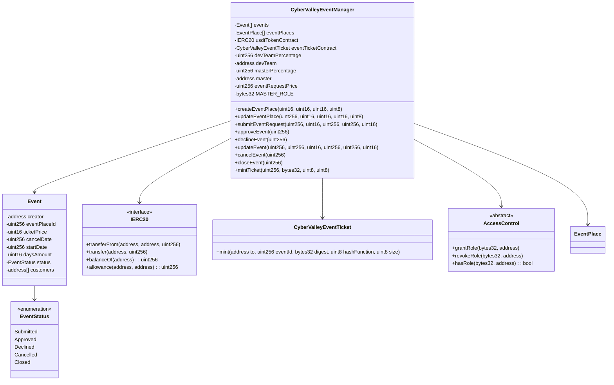
###### Create event place

**Accessible only by master**

Adds a new event place

**Emits** `EventPlaceUpdated`

Validations:
- `eventPlace.maxTickets >= eventPlace.minTickets`, "Max tickets must be greater or equal min tickets"
- `eventPlace.maxTickets > 0 && eventPlace.minTickets > 0 && eventPlace.minPrice > 0 && eventPlace.minDays > 0`, "Values must be greater than zero"

###### Update event place

**Accessible only by master**

Updates existing event place by it's id

> **Warning:** Event place can't be changed if there is another event

**Emits** `EventPlaceUpdated`

Validations:
- `eventPlaceId < eventPlaces.length`, "eventPlaceId should exist"
- `eventPlace.maxTickets >= eventPlace.minTickets`, "Max tickets must be greater or equal min tickets"
- `eventPlace.maxTickets > 0 && eventPlace.minTickets > 0 && eventPlace.minPrice > 0 && eventPlace.minDays > 0`, "Values must be greater than zero"

###### Submit event request

**Public**

Creates new event request.

Validations:
- `usdtTokenContract.balanceOf(msg.sender) >= eventRequestPrice`, "Not enough tokens"
- `usdtTokenContract.allowance(msg.sender, address(this)) >= eventRequestPrice`, "Required amount was not allowed"

###### Approve event

**Accessible only by master**

Transforms event request into the proper event which is visible to others

**Emits** `EventStatusChanged`

Validations:

- `evt.status == EventStatus.Submitted`, "Event status differs from submitted"

###### Decline event

**Accessible only by master**

Removes event request from the queue and refunds means to the creator

**Emits** `EventStatusChanged`

Validations:

- `evt.status == EventStatus.Submitted`, "Event status differs from submitted"

###### Update event

**Accessible only by master**

Allows to change the event data.

**Emits** `EventUpdated`

###### Cancel event

**Accessible only by master**

Cancels given event and refunds all means between creator and customers who bought a ticket

**Emits** `EventStatusChanged`

Validations:

- `evt.status == EventStatus.Approved`, "Only event in approved state can be cancelled"
- `block.timestamp >= evt.cancelDate`, "Event can not be cancelled before setted date"

###### Close event

**Accessible only by master**

Closes given event and sends means to the master, creator and dev team according to their shares

**Emits** `EventStatusChanged`

Validations:

- `evt.status == EventStatus.Approved`, "Only event in approved state can be closed"
- `block.timestamp >= evt.startDate + evt.daysAmount * SECONDS_IN_DAY`, "Event has not been finished yet"

###### Mint ticket

**Accessible by event manager**

Checks if provided NFT was minted by the `EventManager` contract and connected to the given event.

> **Warning:** Marks the ticket as used for the current day and makes it impossible to reenter the event

Validations:

- `evt.customers.length < eventPlaces[evt.eventPlaceId].maxTickets`, "Sold out"

##### Event ticket

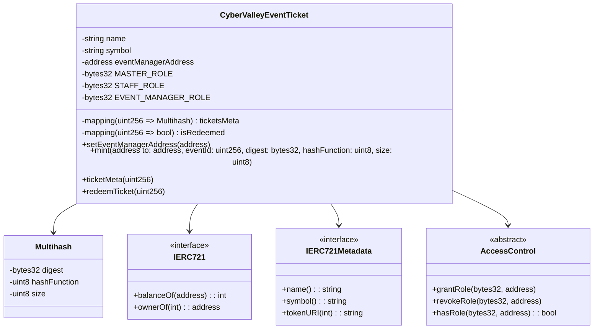
#### Backend

It's required for the two general purposes:

- Temporal storage for the event requests
- Indexing of smart contract state

Both of this solutions provide the most minimal off-chain reading pricing (probably even fit into free tier) and allow to publicly expose them without difficult caching system. Also all data will be stored locally, so it could be processed or aggregated in many wanted ways.

##### Indexer

Listens to logs of `EventManager` and `EventTicket` via WebSocket and store all events in the database. Catches up on possible downtime via using `getLogs`, starting from last event block number.

##### Sign-in with Ethereum

Because of requirement to allow posting and fetching event requests for the master some authentication process should be made. It could be made with JWT and [Infura's `personal_sign` method](https://docs.metamask.io/wallet/how-to/sign-data/#use-personal_sign)

##### API

###### GET /events

**Authority** `PUBLIC`

**Returns** All available events in the system.

For `EVENT:READ_SENSITIVE` or event's creator receive `EventSensitiveModel`.

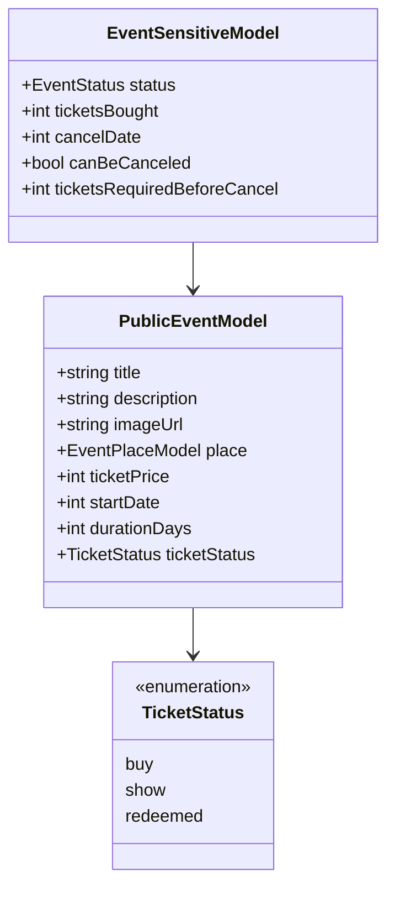
###### GET /events/<int:event-id>/tickets/<str:ticket-id>

**Authority** `EVENT:CREATE`, `TICKET:UPDATE` or ticket's owner

**Returns** Ticket metadata for the given event

```mermaid
classDiagram
    class EventTicketModel {
        +Socials socials
    }
```
###### GET /places

**Authority** `PUBLIC`

**Returns** List of available places

```mermaid
classDiagram
    class EventPlaceModel {
        +int id
        +string title
        +int maxTickets
        +int minTickets
        +int minPrice
        +int minDays
        +boolean available
    }
```
###### GET /notifications

**Authority** `PUBLIC`

**Return** List of notifications for the current user

```mermaid
classDiagram
    class NotificationModel {
        +string title
        +string body
        +int seenAt
    }
```
###### PUT /ipfs

Accepts provided data (file or text), stores it in IPFS and returns [CID](https://docs.ipfs.tech/how-to/address-ipfs-on-web/#path-gateway)

###### POST /auth/generate-nonce/{public-address}

Generates session and checks if the given `public-address` is allowed to sign-in

**Returns** nonce or `403`

###### POST /auth/verify-signature/{public-address}

Verifies signature and returns JWT

**Returns** JWT token or `403`

```mermaid
classDiagram
    class VerifySignatureModel {
        +string signature
    }
```
#### Frontend

##### Page structure

```mermaid
flowchart TD
    A[Main Page] --> B[Event List]
    A --> C[Account]
    A --> D[Notifications]
    A --> E[Create Event]
    A --> F[Manage]

    B --> G[Event Details]
    G --> H[Attend Event]
    G --> I[Edit Event]

```
##### Main Page

Only authorized users (via [sign-in with Ethereum](https://docs.login.xyz/)) can have access to this page.

It provides the following components:

- **Notifications** - Amount of unread notifications with link to the [Notifications page](#notifications)
- **Event list** - Top `N` upcoming events and link to the [Events list page](#events-list)
- **Navigation** - List of available base pages for the current user
  - _Create event_ - Redirects to [Create event page](#create-event)
  - _Manage_ - Shown to `MANAGE:ACCESS` authority and redirects to the system [Manage page](#manage)
  - _Home_ - Redirects to the [Main Page](#main-page)
  - _Account_ - Redirects to the [Account page](#account)

[UI](https://excalidraw.com/?element=IGeC3qEnw6SEahcF-W6_G#room=70c146a09811de73a1cc,hq_dTKi_kHDEdIe1RL4T7g)

##### Notifications

Page renders a list of models returned by [GET /notifications](#get-notifications) endpoint

Each notification can be opened to get description and mark it as `seen`

##### Events list

Page renders a list of models returned by [GET /events](#get-events) endpoint

Each event card contains the following fields:

- Cover image
- Title
- Place title
- Start date

On click event card redirects to the [Event page](#event)

[UI](https://excalidraw.com/?element=A0GKWX9waISgJWCArAagX#room=70c146a09811de73a1cc,hq_dTKi_kHDEdIe1RL4T7g)

##### Event

Works with the model from [GET /events](#get-events) endpoint

Accepts `eventId` from URL parameters.

**If creator** handled by the back-end, so simple conditional rendering is needed. Only check for `TICKET:REDEEM` is required

- Cover image
- Title
- Place title
- Start date
- Description
- Ticket price
- Ticket status
  - **buy** - Attend button. Navigates to [Attend event page](#attend-event)
  - **show** - Show ticket button
  - **redeemed** - Ticket redeemed
- **if staff**
  - Redeem ticket
- **if creator**
  - Edit
  - if `canBeCanceled`
    - cancel date
    - required N tickets
- **if master**
  - if `canBeCanceled`
    - cancel date
    - required N tickets
  - if `status` is `pending`:
    - Decline / approve buttons

> Currently event model is pretty small, so it could be extracted from `TanStack Query` cache via [ensureQueryData](https://tanstack.com/query/latest/docs/reference/QueryClient/#queryclientensurequerydata).

[UI](https://excalidraw.com/?element=A0GKWX9waISgJWCArAagX#room=70c146a09811de73a1cc,hq_dTKi_kHDEdIe1RL4T7g)

##### Attend event

Requests a user to input his socials from [Save socials](#save-socials) section and redirects to the [Payment page](#payment). Consists of select box and input text field without any validation.

After payment redirects to [Operation status page](#operation-status) and shows:

- **On success** ticket QR code
- **On failure** failure details

[UI](https://excalidraw.com/?element=LlyKYIWZ3fWJ0lp0pX9po#room=70c146a09811de73a1cc,hq_dTKi_kHDEdIe1RL4T7g)

###### Questions

- [Do socials really should be saved in IPFS or can be stored on the back-end?](#do-socials-really-should-be-saved-in-ipfs-or-can-be-stored-on-the-back-end)

##### Create event

Requests a user to provide [Event data](#event-data) and `Confirm` button which redirects to [Payment page](#payment)

- **imageUrl** - Image file or pasting should be accepted in the form, then it should be sent with [PUT /ipfs](#put-ipfs) to get a CID for the further processing

Other invariants should be checked in accordance to [Event data](#event-data) specification

[UI](https://excalidraw.com/?element=884G2lWaGUN9FsHkarxxG#room=70c146a09811de73a1cc,hq_dTKi_kHDEdIe1RL4T7g)

##### Edit event

Works the same as [Create event page](#create-event), but instead of payment invokes `updateEvent` method of `EventManager` contract

[UI](https://excalidraw.com/?element=ECGnLzjTF3oespczMEN3K#room=70c146a09811de73a1cc,hq_dTKi_kHDEdIe1RL4T7g)

##### Account

Provides personal info to the user:

- **Events** - any relative i.e. attented or created. Master should see only `pending`
- **Logout** - allows to logout from the app

##### Manage

Provides administration features for the existing entities:

- **Event place** - only places without approved events can be edited
- **Staff** - add or remove staff by EOA address

##### Payment

Generic page for the payment

##### Operation status

Shows result of the made transaction

## Questions

### Both desktop and mobile are required?

> Mobile only

### Is it required to verify tickets without internet connection?

> No

### Will be there multiple masters or the only one in foreseeable future?

> Only one

### Event request price fixed in ETH, depends on ETH/USD rate or could be changed by the master?

> Smart contract should work with USDT

### Is a ticket transfer allowed e.g. customer A bought a ticket, but sent it to the customer B?

> Yes

It requires additional UI and flows to properly update ticket's meta data, so this feature will be skipped in the V1

### Will tickets have some metainfo about the owner (name, number etc)

> Yes, socials i.e. one or many {Telegram, Discord, Instagram, Whats App}

### Is it applicable to show available seats count for all (so the creator and master can see it as well without additional screen)?

> Yes

### UI design references

> https://dribbble.com/shots/23082238-Earthquake-Warning-App-Cyberpunk-Design-Style

### Do socials really should be saved in IPFS or can be stored on the back-end?

TBD

## How to run

```bash
make -C ethereum/ ganache
make -C backend/ run # New terminal
make -C client/ dev # New terminal
make -C backend/ seed-db
make -C ethereum/ deploy-dev # Copy new contract addresses from the stdout to .env
make -C backend/ run-indexer # New terminal
# Rerun backend & frontend
make -C backend/ run # New terminal
make -C client/ dev # New terminal
```

**Emits** `EventPlaceUpdated`

```mermaid
sequenceDiagram
    actor Master
    participant TicketsApp
    participant SmartContract

    Master->>TicketsApp: Updated event place data
    TicketsApp->>SmartContract: updateEventPlace(eventPlaceId, maxTickets, minTickets, minPrice, minDays)
    activate SmartContract
    SmartContract->>SmartContract: _validateEventPlace(place)
    SmartContract-->>TicketsApp: Emits EventPlaceUpdated
    deactivate SmartContract
```
#### Save socials

Supported socials:

- Telegram
- Discord
- Whats App
- Instagram

##### V1

Used socials stored in the browser cache, so customer should input his social on each new device

```mermaid
sequenceDiagram
    actor Customer
    participant TicketsApp
    actor BrowserLocalStorage

    Customer->>TicketsApp: Provide one of the socials
    TicketsApp->>BrowserLocalStorage: Save socials for the future use
```
##### V2

Used socials stored in the centralized database which allows to sync state of the all devices

```mermaid
sequenceDiagram
    actor Customer
    participant TicketsApp
    participant Backend
    participant Database
    actor BrowserLocalStorage

    Customer->>TicketsApp: Provide one of the socials
    TicketsApp->>BrowserLocalStorage: Save socials for the future use
    TicketsApp->>Backend: Send used socials
    Backend->>Database: Persist used socials
```
#### Submit event request

```mermaid
classDiagram
    class EventRequest {
        +uint256 eventPlaceId
        +uint16 ticketPrice
        +uint256 cancelDate
        +uint256 startDate
        +uint16 daysAmount
    }
```
```mermaid
sequenceDiagram
    actor Creator
    participant TicketsApp
    participant EventManager
    participant Backend
    actor ERC20Contract
    actor Master

    Creator->>TicketsApp: Fill event request form
    TicketsApp->>Backend: Store metadata
    TicketsApp->>EventManager: Submit event request
    activate EventManager
    EventManager->>ERC20Contract: Transfer request fee
    EventManager-->>Backend: Emits NewEventRequest
    deactivate EventManager
    TicketsApp->>Creator: Event successfully requested
    TicketsApp->>Master: New event request
```
#### Approve event request

```mermaid
sequenceDiagram
    actor Master
    participant TicketsApp
    participant EventManager
    participant Backend

    Master->>TicketsApp: Approve event
    TicketsApp->>EventManager: Approve event
    activate EventManager
    EventManager-->>Backend: Emits EventStatusChanged
    deactivate EventManager
```
#### Decline event request

```mermaid
sequenceDiagram
    actor Master
    participant TicketsApp
    participant EventManager
    participant Backend
    actor ERC20Contract

    Master->>TicketsApp: Decline event
    TicketsApp->>EventManager: Decline event
    activate EventManager
    EventManager->>ERC20Contract: Refund request fee
    EventManager-->>Backend: Emits EventStatusChanged
    deactivate EventManager
```
#### Edit event

```mermaid
sequenceDiagram
    actor Creator
    participant TicketsApp
    participant EventManager
    participant Backend
    actor Master

    Creator->>TicketsApp: Edit event request
    activate EventManager

    alt Event request is pending
        TicketsApp->>EventManager: Update event data
        EventManager-->>TicketsApp: Emits EventUpdated
        TicketsApp->>Creator: Event request updated
    else Event approved
        TicketsApp->>EventManager: Add event edit
        EventManager-->>TicketsApp: Emits EventEditRequested
        TicketsApp->>Master: Requested edition of approved event
    end

    deactivate EventManager
```
#### List events

```mermaid
sequenceDiagram
    actor Customer
    participant TicketsApp
    participant Backend

    Customer->>TicketsApp: List events
    TicketsApp->>Backend: View events

    loop for each event
        TicketsApp->>Customer: Show event
    end
```
#### Buy ticket

##### V1

```mermaid
sequenceDiagram
    actor Customer
    participant TicketsApp
    participant EventManager
    participant ERC20Contract
    participant EventTicket

    Customer->>TicketsApp: Attend to event
    TicketsApp->>EventManager: Buy ticket
    activate EventManager
    EventManager->>ERC20Contract: Transfer tokens from customer
    EventManager->>EventTicket: Mint ticket
    EventTicket-->>TicketsApp: Emits EventTicketVerified
    deactivate EventManager
    TicketsApp->>Customer: Congratulations, here is your ticket
```
#### Add / remove staff

```mermaid
sequenceDiagram
    actor Master
    participant TicketsApp
    participant EventManager

    Master->>TicketsApp: Make EOA staff
    TicketsApp->>EventManager: Grant / revoke staff role
```
#### Show ticket

```mermaid
sequenceDiagram
    actor Customer
    participant TicketsApp
    participant SmartContract
    participant CyberValleyEventTicket

    Customer->>TicketsApp: Show ticket for the given event
    TicketsApp->>CyberValleyEventTicket: ticketMeta(tokenId)
    TicketsApp->>Customer: Show ticket QR
```
#### Verify bought ticket

```mermaid
sequenceDiagram
    actor Customer
    actor Staff
    participant TicketsApp
    participant EventTicket

    Customer->>TicketsApp: Display QR
    Customer->>Staff: Show QR
    Staff->>TicketsApp: Verify QR
    TicketsApp->>EventTicket: Redeem ticket
```
#### Close event

```mermaid
sequenceDiagram
    actor Master
    participant TicketsApp
    participant EventManager
    actor ERC20Contract
    participant Backend

    Master->>TicketsApp: Close event
    TicketsApp->>EventManager: Close event
    activate EventManager
    EventManager->>ERC20Contract: Spread shares between master, creator and devTeam
    EventManager->>Backend: Emit EventStatusChanged
    deactivate EventManager
```
### Tech stack

Solidity, OpenZeppelin, React, TypeScript, Tailwind, ethers.js, IPFS

Also a thin backend over database is required to provide free of charge ability to change event request data before it's approve, so it'll be implemented with Python, PostgreSQL and Django.

### Excluded features from the first stage

Given list of features can be interpreted as obviously required or any section below can unintentionally imply them, so they explicitly mentioned

- Tickets refund
- Cancel or refund event request submission
- Any sort of push notifications about any updates or new data
- Ticket price change on sold out and increasing available seats
- Remove assigned staff person to the event

### Proxy contract vs multiple versions

Because of big amount of reads from the blockchain (which lead to spending gas on call delegation in proxy) we offer to use multiple versions and support them on the client side. To prevent difficulties of funds & data migration between versions, we'll create new events in a new version, but still support the previous ones until all events there will be closed or canceled.

### Component design

#### General overview

```mermaid
flowchart TD
    subgraph Customer
        A[Customer]
    end

    subgraph TicketsApp
        B[TicketsApp]
    end

    subgraph SmartContracts
        C[CyberValleyEventManager.sol]
        D[CyberValleyEventTicket.sol]
        E[DateOverlapChecker.sol]
    end

    subgraph Backend
        F[Backend]
        G[Database]
    end

    subgraph IPFS
        H[IPFS]
    end

    A --> B
    B --> C
    B --> D
    B --> E
    B --> H
    B --> F
    F --> G

    C --> D
    C --> E

    classDef customer fill:#e1f5fe
    classDef app fill:#f3e5f5
    classDef contracts fill:#e8f5e8
    classDef backend fill:#fff3e0
    classDef storage fill:#fce4ec

    class A customer
    class B app
    class C,D,E contracts
    class F backend
    class G storage
    class H storage
```
#### Smart contract
##### Event manager

```mermaid
classDiagram
    class CyberValleyEventManager {
        -Event[] events
        -EventPlace[] eventPlaces
        -IERC20 usdtTokenContract
        -CyberValleyEventTicket eventTicketContract
        -uint256 devTeamPercentage
        -address devTeam
        -uint256 masterPercentage
        -address master
        -uint256 eventRequestPrice
        -bytes32 MASTER_ROLE

        +createEventPlace(uint16, uint16, uint16, uint8)
        +updateEventPlace(uint256, uint16, uint16, uint16, uint8)
        +submitEventRequest(uint256, uint16, uint256, uint256, uint16)
        +approveEvent(uint256)
        +declineEvent(uint256)
        +updateEvent(uint256, uint256, uint16, uint256, uint256, uint16)
        +cancelEvent(uint256)
        +closeEvent(uint256)
        +mintTicket(uint256, bytes32, uint8, uint8)
    }

    class Event {
        -address creator
        -uint256 eventPlaceId
        -uint16 ticketPrice
        -uint256 cancelDate
        -uint256 startDate
        -uint16 daysAmount
        -EventStatus status
        -address[] customers
    }

    class EventStatus {
        <<enumeration>>
        Submitted
        Approved
        Declined
        Cancelled
        Closed
    }

    class IERC20 {
        <<interface>>
        +transferFrom(address, address, uint256)
        +transfer(address, uint256)
        +balanceOf(address): uint256
        +allowance(address, address): uint256
    }

    class CyberValleyEventTicket {
        +mint(address to, uint256 eventId, bytes32 digest, uint8 hashFunction, uint8 size)
    }

    class AccessControl {
        <<abstract>>
        +grantRole(bytes32, address)
        +revokeRole(bytes32, address)
        +hasRole(bytes32, address): bool
    }

    CyberValleyEventManager --> AccessControl
    CyberValleyEventManager --> IERC20
    CyberValleyEventManager --> CyberValleyEventTicket
    CyberValleyEventManager --> Event
    CyberValleyEventManager --> EventPlace
    Event --> EventStatus
```

###### Create event place

**Accessible only by master**

Adds a new event place

**Emits** `EventPlaceUpdated`

Validations:
- `eventPlace.maxTickets >= eventPlace.minTickets`, "Max tickets must be greater or equal min tickets"
- `eventPlace.maxTickets > 0 && eventPlace.minTickets > 0 && eventPlace.minPrice > 0 && eventPlace.minDays > 0`, "Values must be greater than zero"

###### Update event place

**Accessible only by master**

Updates existing event place by it's id

> **Warning:** Event place can't be changed if there is another event

**Emits** `EventPlaceUpdated`

Validations:
- `eventPlaceId < eventPlaces.length`, "eventPlaceId should exist"
- `eventPlace.maxTickets >= eventPlace.minTickets`, "Max tickets must be greater or equal min tickets"
- `eventPlace.maxTickets > 0 && eventPlace.minTickets > 0 && eventPlace.minPrice > 0 && eventPlace.minDays > 0`, "Values must be greater than zero"

###### Submit event request

**Public**

Creates new event request.

Validations:
- `usdtTokenContract.balanceOf(msg.sender) >= eventRequestPrice`, "Not enough tokens"
- `usdtTokenContract.allowance(msg.sender, address(this)) >= eventRequestPrice`, "Required amount was not allowed"

###### Approve event

**Accessible only by master**

Transforms event request into the proper event which is visible to others

**Emits** `EventStatusChanged`

Validations:

- `evt.status == EventStatus.Submitted`, "Event status differs from submitted"

###### Decline event

**Accessible only by master**

Removes event request from the queue and refunds means to the creator

**Emits** `EventStatusChanged`

Validations:

- `evt.status == EventStatus.Submitted`, "Event status differs from submitted"

###### Update event

**Accessible only by master**

Allows to change the event data.

**Emits** `EventUpdated`

###### Cancel event

**Accessible only by master**

Cancels given event and refunds all means between creator and customers who bought a ticket

**Emits** `EventStatusChanged`

Validations:

- `evt.status == EventStatus.Approved`, "Only event in approved state can be cancelled"
- `block.timestamp >= evt.cancelDate`, "Event can not be cancelled before setted date"

###### Close event

**Accessible only by master**

Closes given event and sends means to the master, creator and dev team according to their shares

**Emits** `EventStatusChanged`

Validations:

- `evt.status == EventStatus.Approved`, "Only event in approved state can be closed"
- `block.timestamp >= evt.startDate + evt.daysAmount * SECONDS_IN_DAY`, "Event has not been finished yet"

###### Mint ticket

**Accessible by event manager**

Checks if provided NFT was minted by the `EventManager` contract and connected to the given event.

> **Warning:** Marks the ticket as used for the current day and makes it impossible to reenter the event

Validations:

- `evt.customers.length < eventPlaces[evt.eventPlaceId].maxTickets`, "Sold out"

##### Event ticket

```mermaid
classDiagram
    class CyberValleyEventTicket {
        -string name
        -string symbol
        -address eventManagerAddress
        -mapping(uint256 => Multihash) ticketsMeta
        -mapping(uint256 => bool) isRedeemed
        -bytes32 MASTER_ROLE
        -bytes32 STAFF_ROLE
        -bytes32 EVENT_MANAGER_ROLE

        +setEventManagerAddress(address _eventManagerAddress)
        +mint(address to, uint256 eventId, bytes32 digest, uint8 hashFunction, uint8 size)
        +ticketMeta(uint256 tokenId) (bytes32 digest, uint8 hashFunction, uint8 size)
        +redeemTicket(uint256 tokenId)
    }

    class Multihash {
        -bytes32 digest
        -uint8 hashFunction
        -uint8 size
    }

    class IERC721 {
        <<interface>>
        +balanceOf(address) int
        +ownerOf(int) address
    }

    class IERC721Metadata {
        <<interface>>
        +name() string
        +symbol() string
        +tokenURI(int) string
    }

    class AccessControl {
        <<abstract>>
        +grantRole(bytes32, address)
        +revokeRole(bytes32, address)
        +hasRole(bytes32, address) bool
    }

    CyberValleyEventTicket --> Multihash
    CyberValleyEventTicket ..|> IERC721
    CyberValleyEventTicket ..|> IERC721Metadata
    CyberValleyEventTicket ..|> AccessControl
```

#### Backend

It's required for the two general purposes:

- Temporal storage for the event requests
- Indexing of smart contract state

Both of this solutions provide the most minimal off-chain reading pricing (probably even fit into free tier) and allow to publicly expose them without difficult caching system. Also all data will be stored locally, so it could be processed or aggregated in many wanted ways.

##### Indexer

Listens to logs of `EventManager` and `EventTicket` via WebSocket and store all events in the database. Catches up on possible downtime via using `getLogs`, starting from last event block number.

##### Sign-in with Ethereum

Because of requirement to allow posting and fetching event requests for the master some authentication process should be made. It could be made with JWT and [Infura's `personal_sign` method](https://docs.metamask.io/wallet/how-to/sign-data/#use-personal_sign)

##### API

###### GET /events

**Authority** `PUBLIC`

**Returns** All available events in the system.

For `EVENT:READ_SENSITIVE` or event's creator receive `EventSensitiveModel`.

```mermaid
classDiagram
    class PublicEventModel {
        +string title
        +string description
        +string imageUrl
        +EventPlaceModel place
        +int ticketPrice
        +int startDate
        +int durationDays
        +TicketStatus ticketStatus
    }

    class EventSensitiveModel {
        +EventStatus status
        +int ticketsBought
        +int cancelDate
        +bool canBeCanceled
        +int ticketsRequiredBeforeCancel
    }

    class TicketStatus {
        <<enumeration>>
        buy
        show
        redeemed
    }

    EventSensitiveModel --> PublicEventModel
    PublicEventModel --> TicketStatus
```

###### GET /events/<int:event-id>/tickets/<str:ticket-id>

**Authority** `EVENT:CREATE`, `TICKET:UPDATE` or ticket's owner

**Returns** Ticket metadata for the given event

```mermaid
classDiagram
    class EventTicketModel {
        +Socials socials
    }
```

###### GET /places

**Authority** `PUBLIC`

**Returns** List of available places

```mermaid
classDiagram
    class EventPlaceModel {
        +int id
        +string title
        +int maxTickets
        +int minTickets
        +int minPrice
        +int minDays
        +boolean available
    }
```

###### GET /notifications

**Authority** `PUBLIC`

**Return** List of notifications for the current user

```mermaid
classDiagram
    class NotificationModel {
        +string title
        +string body
        +int seenAt
    }
```

###### PUT /ipfs

Accepts provided data (file or text), stores it in IPFS and returns [CID](https://docs.ipfs.tech/how-to/address-ipfs-on-web/#path-gateway)

###### POST /auth/generate-nonce/{public-address}

Generates session and checks if the given `public-address` is allowed to sign-in

**Returns** nonce or `403`

###### POST /auth/verify-signature/{public-address}

Verifies signature and returns JWT

**Returns** JWT token or `403`

```mermaid
classDiagram
    class VerifySignatureModel {
        +string signature
    }
```

#### Frontend

##### Page structure

```mermaid
flowchart TD
    Main[Main - APP:ACCESS]
    EventList[Event list - APP:ACCESS]
    Event[Event - APP:ACCESS]
    Attend[Attend - APP:ACCESS]
    Edit[Edit - EVENT:CREATE]
    Account[Account - APP:ACCESS]
    Notifications[Notifications - APP:ACCESS]
    CreateEvent[Create event - APP:ACCESS]
    Manage[Manage - MANAGE:ACCESS]

    Main --> EventList
    EventList --> Event
    Event --> Attend
    Event --> Edit
    Main --> Account
    Main --> Notifications
    Main --> CreateEvent
    Main --> Manage
```

##### Main Page

Only authorized users (via [sign-in with Ethereum](https://docs.login.xyz/)) can have access to this page.

It provides the following components:

- **Notifications** - Amount of unread notifications with link to the [Notifications page](#notifications)
- **Event list** - Top `N` upcoming events and link to the [Events list page](#events-list)
- **Navigation** - List of available base pages for the current user
  - _Create event_ - Redirects to [Create event page](#create-event)
  - _Manage_ - Shown to `MANAGE:ACCESS` authority and redirects to the system [Manage page](#manage)
  - _Home_ - Redirects to the [Main Page](#main-page)
  - _Account_ - Redirects to the [Account page](#account)

[UI](https://excalidraw.com/?element=IGeC3qEnw6SEahcF-W6_G#room=70c146a09811de73a1cc,hq_dTKi_kHDEdIe1RL4T7g)

##### Notifications

Page renders a list of models returned by [GET /notifications](#get-notifications) endpoint

Each notification can be opened to get description and mark it as `seen`

##### Events list

Page renders a list of models returned by [GET /events](#get-events) endpoint

Each event card contains the following fields:

- Cover image
- Title
- Place title
- Start date

On click event card redirects to the [Event page](#event)

[UI](https://excalidraw.com/?element=A0GKWX9waISgJWCArAagX#room=70c146a09811de73a1cc,hq_dTKi_kHDEdIe1RL4T7g)

##### Event

Works with the model from [GET /events](#get-events) endpoint

Accepts `eventId` from URL parameters.

**If creator** handled by the back-end, so simple conditional rendering is needed. Only check for `TICKET:REDEEM` is required

- Cover image
- Title
- Place title
- Start date
- Description
- Ticket price
- Ticket status
  - **buy** - Attend button. Navigates to [Attend event page](#attend-event)
  - **show** - Show ticket button
  - **redeemed** - Ticket redeemed
- **if staff**
  - Redeem ticket
- **if creator**
  - Edit
  - if `canBeCanceled`
    - cancel date
    - required N tickets
- **if master**
  - if `canBeCanceled`
    - cancel date
    - required N tickets
  - if `status` is `pending`:
    - Decline / approve buttons

> Currently event model is pretty small, so it could be extracted from `TanStack Query` cache via [ensureQueryData](https://tanstack.com/query/latest/docs/reference/QueryClient/#queryclientensurequerydata).

[UI](https://excalidraw.com/?element=A0GKWX9waISgJWCArAagX#room=70c146a09811de73a1cc,hq_dTKi_kHDEdIe1RL4T7g)

##### Attend event

Requests a user to input his socials from [Save socials](#save-socials) section and redirects to the [Payment page](#payment). Consists of select box and input text field without any validation.

After payment redirects to [Operation status page](#operation-status) and shows:

- **On success** ticket QR code
- **On failure** failure details

[UI](https://excalidraw.com/?element=LlyKYIWZ3fWJ0lp0pX9po#room=70c146a09811de73a1cc,hq_dTKi_kHDEdIe1RL4T7g)

###### Questions

- [Do socials really should be saved in IPFS or can be stored on the back-end?](#do-socials-really-should-be-saved-in-ipfs-or-can-be-stored-on-the-back-end)

##### Create event

Requests a user to provide [Event data](#event-data) and `Confirm` button which redirects to [Payment page](#payment)

- **imageUrl** - Image file or pasting should be accepted in the form, then it should be sent with [PUT /ipfs](#put-ipfs) to get a CID for the further processing

Other invariants should be checked in accordance to [Event data](#event-data) specification

[UI](https://excalidraw.com/?element=884G2lWaGUN9FsHkarxxG#room=70c146a09811de73a1cc,hq_dTKi_kHDEdIe1RL4T7g)

##### Edit event

Works the same as [Create event page](#create-event), but instead of payment invokes `updateEvent` method of `EventManager` contract

[UI](https://excalidraw.com/?element=ECGnLzjTF3oespczMEN3K#room=70c146a09811de73a1cc,hq_dTKi_kHDEdIe1RL4T7g)

##### Account

Provides personal info to the user:

- **Events** - any relative i.e. attented or created. Master should see only `pending`
- **Logout** - allows to logout from the app

##### Manage

Provides administration features for the existing entities:

- **Event place** - only places without approved events can be edited
- **Staff** - add or remove staff by EOA address

##### Payment

Generic page for the payment

##### Operation status

Shows result of the made transaction

## Questions

### Both desktop and mobile are required?

> Mobile only

### Is it required to verify tickets without internet connection?

> No

### Will be there multiple masters or the only one in foreseeable future?

> Only one

### Event request price fixed in ETH, depends on ETH/USD rate or could be changed by the master?

> Smart contract should work with USDT

### Is a ticket transfer allowed e.g. customer A bought a ticket, but sent it to the customer B?

> Yes

It requires additional UI and flows to properly update ticket's meta data, so this feature will be skipped in the V1

### Will tickets have some metainfo about the owner (name, number etc)

> Yes, socials i.e. one or many {Telegram, Discord, Instagram, Whats App}

### Is it applicable to show available seats count for all (so the creator and master can see it as well without additional screen)?

> Yes

### UI design references

> https://dribbble.com/shots/23082238-Earthquake-Warning-App-Cyberpunk-Design-Style

### Do socials really should be saved in IPFS or can be stored on the back-end?

TBD

## How to run

Use `./launch.sh`, it works like a charm

If it didn't, here is a documented way of starting all the things manually

```bash
make -C ethereum/ ganache
make -C backend/ run # New terminal
make -C client/ dev # New terminal
make -C backend/ seed-db
make -C backend/ sync-geodata
make -C ethereum/ deploy-dev # Copy new contract addresses from the stdout to .env
make -C backend/ run-indexer # New terminal
# Rerun backend & frontend
make -C backend/ run # New terminal
make -C client/ dev # New terminal
```

## How to test shaman verification flow

Open link `https://t.me/cyberia_tickets_bot?start=0x9772d9a6A104c162b97767e6a654Be54370A042F` to setup `LocalProvider`s telegram
Open link `https://t.me/cyberia_tickets_bot?start=0xA84036A18ecd8f4F3D21ca7f85BEcC033571b15e_verifyshaman` to start verification (you should login as `0xA84036A18ecd8f4F3D21ca7f85BEcC033571b15e` to the app before or during the process)
