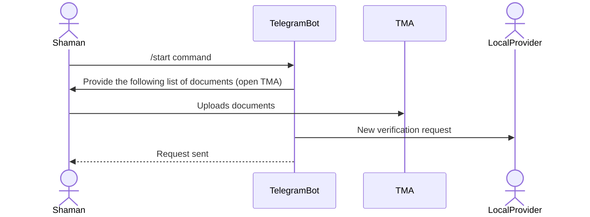
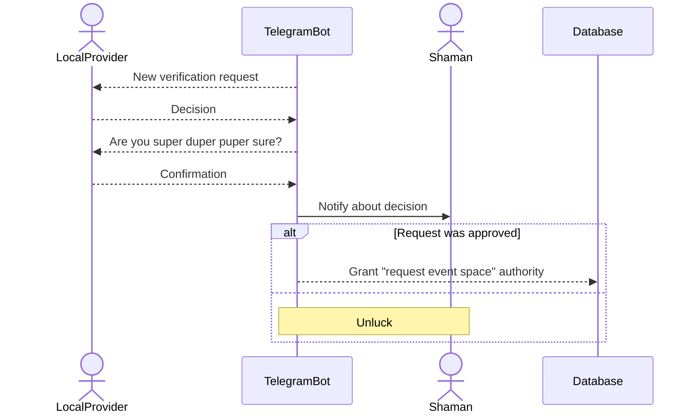

# Extending

## Local Provider - New Role

The current `Master` role is being renamed to `LocalProvider` and retains all of its authorities. At the smart contract level, multiple `LocalProvider`s may exist, each with **their own distinct** share percentage.

Meanwhile, the `Master` role is only capable of adding and removing `LocalProvider`s, which should request the following data in the form:
- EOA (Externally Owned Account)
- Telegram username
- Share percentage

**Questions**:
- If there are multiple `LocalProvider`s, how should shares be calculated for them? (This is crucial for smart contract development)
    - [x] Each `LocalProvider` receives a share for events from `Shaman`s they have approved
    - There is a general share of the total income that is divided among all `LocalProvider`s (i.e., the sum of all their shares equals 1)
- Telegram bots are forbidden to send messages to users who haven't sent any messages to them. So `LocalProvider` would not work properly (receive any notifications from the bot) until they send the `/start` command
    - We may implement a message queue at the DB level and send all unreceived notifications when `LocalProvider` contacts the bot
    - We may forbid registering new `LocalProvider`s until they contact the bot
    - We may simply ignore the issue for now and delegate it to our future selves

**Tasks**:
1. **Rename `Master` to `LocalProvider` role** (~2 hours)
    - [x] @naqerl Update backend user model and migrations
    - [x] @naqerl Update smart contract role constants
    - [x] @redmoor Update frontend role-based components and permissions
2. **Add new `Master` role to the smart contract** (~3 hours)
    - [x] @naqerl Implement multi-LocalProvider share management in contract
    - [x] @naqerl Add LocalProvider registration/removal functions
3. **Implement LocalProvider management system** (~8 hours)
    - [x] @naqerl Back-end syncer for LocalProvider management (3h)
    - [x] @redmoor Front-end LocalProvider management page (5h)
    - [x] @naqerl Back-end add an endpoint that returnes the list of LocalProviders

## Verified Shaman - New Role

The `Apply new event space` button now redirects to the Telegram bot with the following sequence:

After that, the `LocalProvider` validates the payload and clicks either the `approve` or `decline` button, then confirms their decision:

When a `Shaman` becomes a `VerifiedShaman`, they can request a new `EventPlace` from the `Manage` page in the navigation bar. This form is migrated from the `Master`'s `Manage` page.

**Documents to be requested for verification**:
физик индонез
- KTP (owner’s passport/ID);

юр лицо компания (PT/PT PMA)
- KTP or passport director/authorized person (if applicable);
- incorporation documents (Akta Pendirian);
- SK Kemenkumham (registration with the Ministry of Law and Human Rights);

**Questions**:
- [x] Do `LocalProvider`s can add / remove `EventPlace`'s the same way as OldMaster or only accept / decline requests from `VerifiedShaman`

**Tasks**:
1. **Add new `VerifiedShaman` role** (~4 hours)
    - [x] @naqerl Back-end role enumeration and migration (1h)
    - [x] @naqerl Update smart contract (2h)
        - [x] Role & granting
        - [x] Event place request rework
        - [x] Add smart contract tests
        - [x] Update indexer
    - [ ] @redmoor Update role-based permissions and views (1h)
    - [ ] @redmoor Migrate `Manage` page from OldMaster's event place to VerifiedShaman (2h)
2. **Implement Telegram bot verification flow** (~12 hours)
    - [ ] @redmoor Document upload web form (2h)
    - [x] @naqerl Implement web form upload endpoint (1h)
    - [x] @naqerl Verification request workflow with approval/decline (4h)
    - [x] @naqerl LocalProvider notification and decision system (3h)

## Map Integration

The event list page now contains a map that looks similar to the one from Booking.com. It represents CyberValley and contains multiple layers:

1. Upcoming events
2. Points of interest
3. Zone plots

For detailed implementation of this feature, further research of Google's API was done [here](./google-cloud-maps-api.md).

The API was massively improved this spring and provides a wide variety of drawing plots, creating and grouping markers, managing multiple layers and styling different parts of the map. In conclusion, it seems like a great piece of work and all currently requested features may be implemented without much difficulty.

**Questions**
- Now there is a huge mess in the layers that come from "Google My Map". Will there be any order, or the specific layer that is meant for event place selection?

**Tasks**:
1. **Setup Google Maps integration** (~4 hours)
    - [x] @naqerl Setup dynamic map data endpoint & sync via HTTP
    - [x] @redmoor Configure Google Maps API and authentication
    - [x] @redmoor Create base map component with responsive design
2. **Implement upcoming events map view** (~3 hours)
    - [ ] Event markers with custom styling and clustering (3h)
3. **Implement points of interest layer** (~5 hours)
    - [x] @redmoor POI data management and custom markers (2h)
    - [x] @redmoor Category-based filtering and toggle controls (2h)
    - [ ] @naqerl TBD Info windows and interaction handling (1h)
4. **Implement zone plots layer** (~8 hours)
    - [x] Zone boundary drawing and polygon management (4h)
    - [ ] Interactive zone selection for event placement (2h)
5. **Implement layer management system** (~3 hours)
    - [x] Layer toggle controls and visibility management

## Shares Rework

For each event, shares can be set up independently. The `LocalProvider` chooses their value when approving an event request.

Also, as mentioned in the `LocalProvider` section, the new `Master` role can set share values for each of them.

To prevent potentially cumbersome situations in the future, a setter for the `Master`'s share will also be provided at the contract level.

**Tasks**:
1. **Include share setting in event approval flow** (~4 hours)
    - [ ] @redmoor Add 'shares' field to the `LocalProvider` approve form (input) (2h)
    - [ ] @naqerl Backend integration for per-event share storage (1h)
    - [x] @naqerl Smart contract integration for share distribution (1h)
2. **Add Master role management to smart contract** (~3 hours)
    - [x] @naqerl Implement Master share and address setters (2h)
    - [x] @naqerl Update contract deployment and migration scripts (1h)
3. **Update payment distribution system** (~4 hours)
    - [x] @naqerl Modify closeEvent function for multi-LocalProvider shares (2h)
    - [x] @naqerl Update indexer to sync share changes (1h)
    - [x] @naqerl Add share calculation validation (1h)

## Event Request Updates

Due to the previous features, the event request flow should/could be improved in two main ways:
1. Add a new field that requires the `Shaman` to place a marker on one of the provided zone plots where their event will be located
2. Notify the `LocalProvider` not only through in-app notifications, but also via the Telegram bot about new requests

**Questions**:
- [-] Should the `Shaman` choose only one marker, or could they place multiple markers on single/multiple zones?
- What is the exact flow of putting the marker on the tile?

**Tasks**:
1. **Add zone marker selection to event form** (~7 hours)
    - [ ] @redmoor Integrate map component into event creation form (3h)
    - [ ] @redmoor Implement zone marker placement and validation (2h)
    - [x] @naqerl Store zone coordinates in event model (2h)
2. **Add Telegram bot notifications for event requests** (~2 hours)
    - [ ] @naqerl Extend notification system to support Telegram (1h)
    - [ ] @naqerl Integrate with LocalProvider notification flow (1h)

## Telegram integration

Because of tight Telegram integration, it's possible to move social selection to the account page and get rid of it in the new event flow. Here are two possible cases:
1. `Shaman` was registered via In-App wallet with Telegram -> we potentially know their Telegram info and can save it, so it would not be requested
2. `Shaman` logged in another way
    1. They started verification -> the same thing as in p.1
    2. They requested an event -> so we ask for Telegram in priority and mention that they can receive notifications there as well, but other social platforms are still available

**Tasks**:
1. **Move social selection to account page** (~4 hours)
    - [ ] @redmoor Create account settings page with social management (2h)
    - [ ] @redmoor Remove social selection from event creation flow (1h)
    - [ ] @redmoor Update event creation to use stored socials (1h)
2. **Implement smart Telegram detection** (~3 hours)
    - [ ] @naqerl Detect Telegram registration source (1h)
    - [ ] @naqerl Auto-populate Telegram info for verified users (1h)
    - [ ] @naqerl TBD Fallback flow for missing Telegram info (1h)

## Total Estimated Time

**Summary by Feature:**
- **Local Provider System**: ~13 hours
- **Verified Shaman System**: ~16 hours
- **Map Integration**: ~23 hours
- **Shares Rework**: ~11 hours
- **Event Request Updates**: ~9 hours
- **Telegram Integration**: ~7 hours

**Total Estimated Development Time**: ~79 hours
