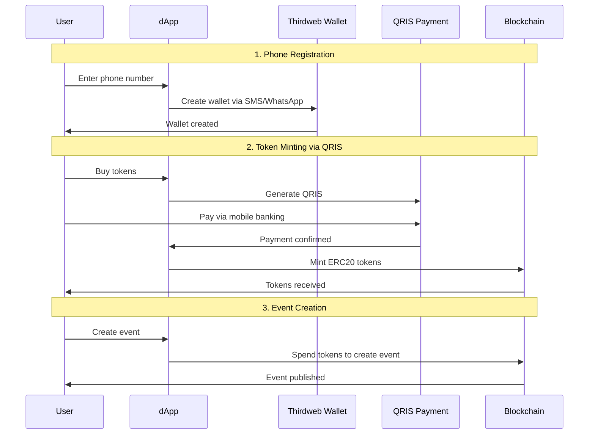
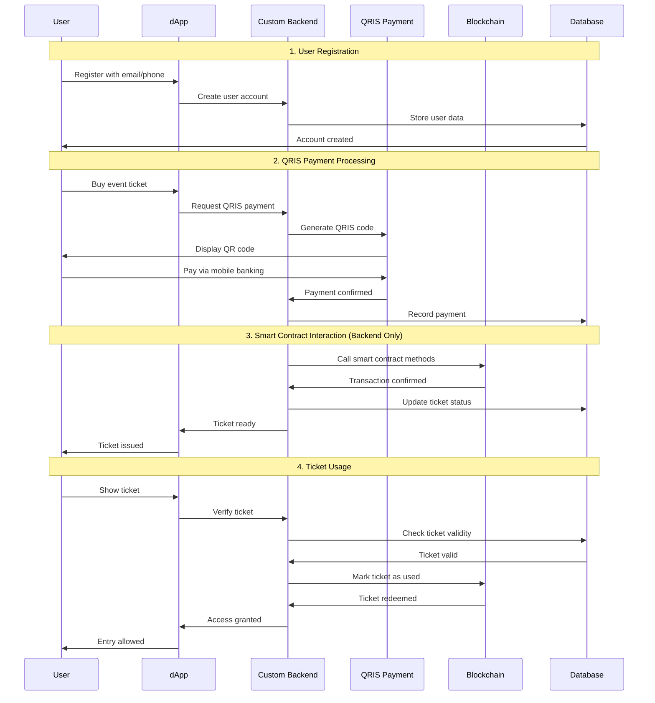

# QRIS integration PRD

## Problem

The system is incapable of accepting payments via the Indonesian fiat payment system

## Solution

Develop an on-ramp solution that will work with a QRIS provider and seamlessly integrate with the current smart contract's business logic

### Two ways

#### My faith is unwavering

Thirdweb has [In-App wallets](https://thirdweb.com/in-app-wallets) which provide normal users with the ability to buy and send ERC20 tokens. The flow would be as follows:

**Pros**:

- OTP and wallet creation out of the box
- Single flow on the front-end for both web3 and fiat users

**Cons**:

- The entire solution depends on Thirdweb, which likely hides implementation details that will only be discovered during development
    - Phone registration process is unclear, as is WhatsApp integration. Fees are also uncertain. Additionally, monthly costs will start from $100 and may reach $500 due to international SMS delivery.

#### We have our own Thirdweb at home

As a robust and predictable alternative, it's possible to build our own solution to handle the on-ramp. We'll get full control over the entire sequence and minimize fees. Basically, we'll create a new back-end service that will accept QRIS payments and in exchange call special smart contract methods that use the same business logic as the current ones. In other words, QRIS users wouldn't even see or know that they interact with the blockchain (no minting, transaction sending, or any Thirdweb components).

**Pros**:

- Deterministic and robust solution
- Full control over each step

**Cons**:

- Front-end needs to be modified to send HTTP requests for QRIS users instead of blockchain transactions

#### Nah, I'd win

The second option feels much better, doesn't it? Surprisingly, the smart contract is only used for three business cases (create event, buy ticket, and redeem ticket). Instead of complex blockchain integration, it could be implemented via a simple backend service that eliminates the 15-minute transaction times and all the complexity around web3. Consider this approach.

### Future steps

Create a POC with Thirdweb and test how the registration process works and how much it costs (Thirdweb's dashboard appears to offer free testing). This will reveal what drawbacks we might face and whether they justify the cost. In both scenarios, there's a plan B that will take more time but is more straightforward in return.
